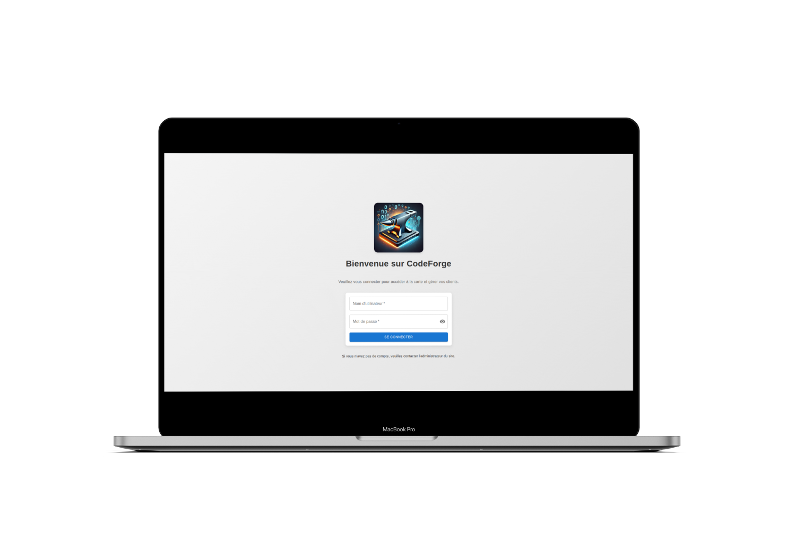
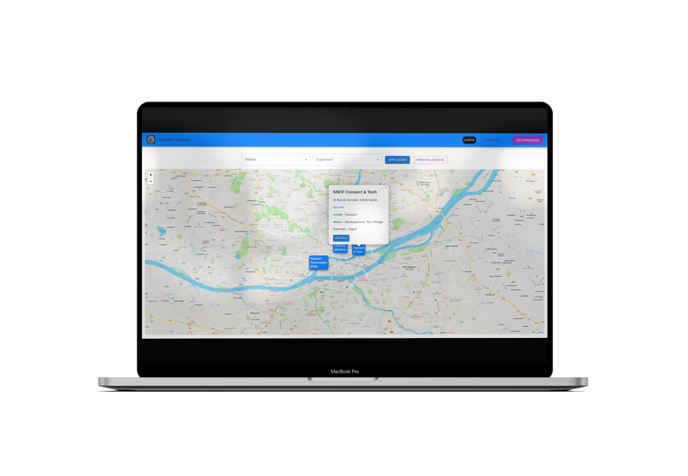
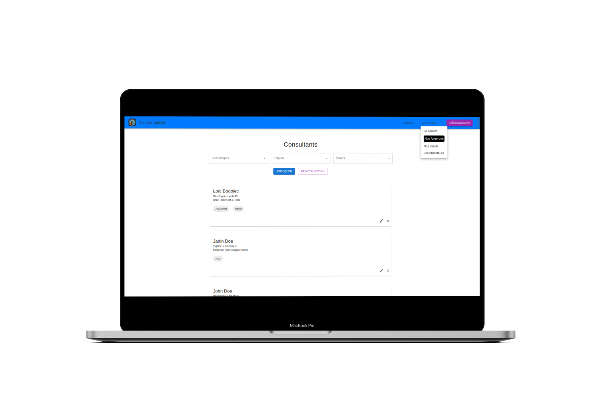
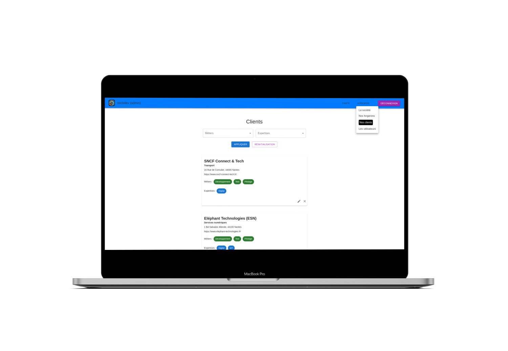

# CodeForge - React + TypeScript + Vite

Ce projet est une application web développée avec React, TypeScript et Vite. Il utilise également Redux pour la gestion de l'état et Material-UI pour les composants d'interface utilisateur.

(Projet personnel toujours en développement)

## Description de l'application

CodeForge permet de visualiser les clients d'une ESN sur une carte. L'application est destinée à un usage interne par les collaborateurs de l'ESN, facilitant ainsi la gestion et le suivi des clients et des consultants.

<p align="center">
  
  
</p>
<p align="center">
  
  
</p>

### Fonctionnalités principales

- **Visualisation des clients sur une carte** : Afficher les clients de l'ESN sur une carte.
- **Gestion des clients** : Voir, ajouter, modifier et supprimer des clients et/ou leurs informations associées.
- **Gestion des consultants et de leurs compétences** : Voir, ajouter, modifier et supprimer les consultants et leurs expertises.
- **Filtrage des informations** : Utiliser un filtrage (basique) pour trouver plus rapidement les informations nécessaires.
- **Gestion des utilisateurs internes de l'application** : Voir, ajouter, modifier et supprimer les utilisateurs et gérer leurs droits (administrateur ou utilisateur simple).

## Installation

1. Clonez le dépôt :

   ```sh
   git clone <url-du-dépôt>
   cd <nom-du-dossier>
   ```

2. Installer les dépendances

   ```sh
   npm install
   ```

Scripts principaux

- npm run start : Démarre le serveur de développement.
- npm run build : Compile le projet pour la production.
- npm run prettier : Formate le code source avec Prettier.
- npm run lint : Lint le code source avec ESLint.
- npm run preview : Prévisualise le build de production.
- npm run test : Lance les tests unitaires.
- [...]

## Utilisation de Vite

Le projet utilise Vite pour le bundling et le développement. La configuration se trouve dans le fichier "vite.config.ts".

## Variables d'environnement

Les variables d'environnement sont définies dans le fichier ".env". Un exemple de fichier est fourni sous le nom de ".env.example".

## Configuration TypeScript

Le projet utilise plusieurs fichiers de configuration TypeScript :

- tsconfig.json : Fichier de configuration principal.
- tsconfig.app.json : Configuration pour l'application.
- tsconfig.node.json : Configuration pour les scripts Node.js.

## Backend Repository

Le dépôt du backend est disponible à l'adresse suivante : [esn-map-server](https://github.com/loic-bodolec/esn-map-server)
