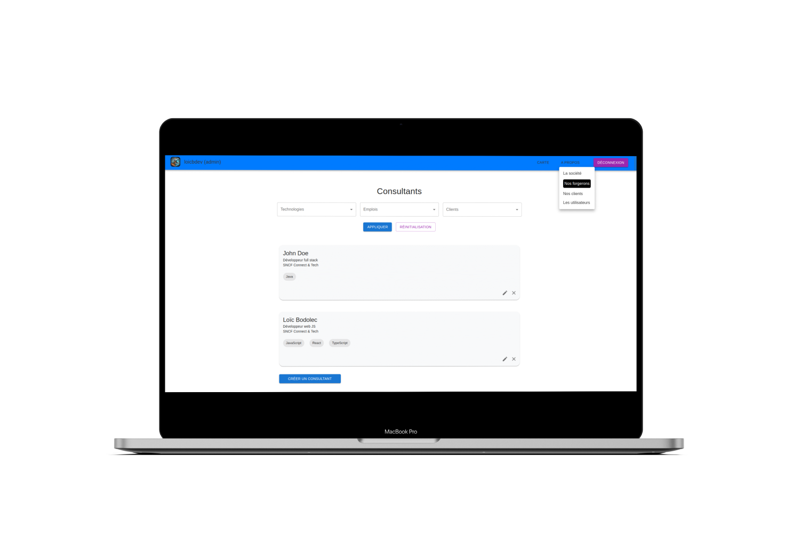

# CodeForge - React + TypeScript + Vite

This project is a web application developed with React, TypeScript, and Vite. It also uses Redux for state management and Material-UI for UI components.

(Personal project still under development)

## Application Description

CodeForge allows you to visualize an IT services company's (ESN) clients on a map. The application is intended for internal use by the company's employees, facilitating the management and tracking of clients and consultants.

<p align="center">
  
  
</p>
<p align="center">
  
  
</p>

### Main Features

- **Client visualization**: Display the company's clients on a map.
- **Client management**: View, add, edit and delete clients and their associated information.
- **Consultant and skill management**: View, add, edit and delete consultants and their expertise.
- **Information filtering**: Use basic filtering to quickly find the necessary information.
- **Internal user management**: View, add, edit and delete users and manage their roles (administrator or regular user).

## Installation

1. Clone the repository:

   ```sh
   git clone <repository-url>
   cd <folder-name>
   ```

2. Install dependencies

   ```sh
   npm install
   ```

Main scripts

- `npm run start`: Starts the development server.
- `npm run build`: Compiles the project for production.
- `npm run prettier`: Formats the source code using Prettier.
- `npm run lint`: Lints the source code using ESLint.
- `npm run preview`: Previews the production build.
- `npm run test`: Runs unit tests.
- [...]

## Using Vite

The project uses Vite for bundling and development. The configuration is located in the "vite.config.ts" file.

## Environment Variables

Environment variables are defined in the ".env" file. An example file is provided under the name ".env.example".

## TypeScript Configuration

The project uses several TypeScript configuration files:

- `tsconfig.json`: Main configuration file.
- `tsconfig.app.json`: Configuration for the application.
- `tsconfig.node.json`: Configuration for Node.js scripts.

## Backend Repository

The backend repository is available at: [esn-map-server](https://github.com/loic-bodolec/esn-map-server)
